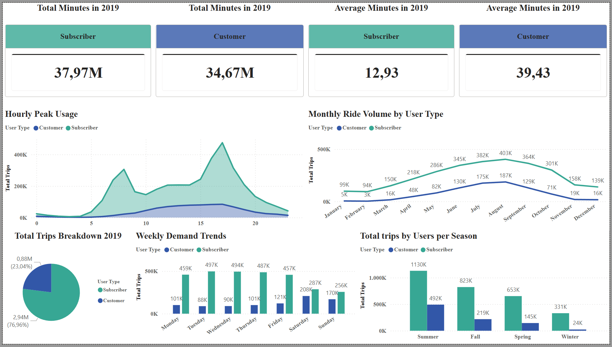

# Cyclistic Bike-Share Data Analysis (2019) 📊🚴‍♂️

## 📝 Project Overview
This is an independent data analytics project where I analyzed public bike-share data from Chicago to practice and showcase my skills.

The main goal of this project was to take a raw dataset, clean and process it using Python, and then create a visual dashboard in Power BI. I wanted to analyze how two different types of users—annual Subscribers and casual Customers—use the bike service differently, and then brainstorm a few simple marketing ideas based on the data.

---

## 🎯 The Analysis Goal
* **Core Question:** How do usage patterns differ between annual Subscribers and casual Customers?
* **Objective:** Find insights that could help a marketing team understand how to encourage casual riders to sign up for annual subscriptions.

---

## 🛠️ Tools Used
* **Python (Jupyter Notebook):** Used for the initial data cleaning, handling missing values, and preparing the dataset (`Bike_Trips__v1_2019.ipynb`).
* **Power BI:** Used to build the interactive dashboard and visualize the final data. Due to file size limits on GitHub, [you can download the .pbix file from Google Drive here](https://drive.google.com/file/d/15onR5i4d6malq10ID8R6faFLcxb-9FeX/view?usp=sharing).
---

## 🧹 Phase 1: Data Cleaning & Preparing (Python)
In the Jupyter Notebook, I performed the following steps to clean the 2019 dataset:
* Loaded and combined the raw data files.
* Cleaned up missing data and checked for duplicate entries.
* Created new columns to make the analysis easier:
    * `trip_duration_duration` (Trip duration calculated in minutes)
    * `day_of_week` (Day of the week the ride took place)
    * `month` & `season` (Month and Season of the ride)
    * `hour_of_day` (The hour the ride started)
* Exported the clean data into a final CSV file.

---

## 📊 Phase 2: Power BI Dashboard & Insights

### Key Metrics (KPIs)
* **Total Minutes:** Total time spent riding by each user group.
* **Average Minutes:** The average length of a single trip. (Interestingly, casual Customers have a much higher average trip duration than Subscribers).

### Visualizations & Findings
* **Total Trips Breakdown (Pie Chart):** Subscribers made up the majority of the rides in 2019 with **76.96% (2.94M trips)**, while casual Customers accounted for **23.04% (0.88M trips)**.
* **Hourly Peak Usage (Line Chart):** Subscribers have two major peaks during the day—at **08:00 AM** and **05:00 PM**—which clearly shows they use the bikes to commute to and from work. Customers show a steady increase that peaks in the afternoon.
* **Weekly Demand Trends (Bar Chart):** Subscribers ride consistently from Monday to Friday. On the other hand, Customers prefer the weekends, where their trip numbers spike significantly.
* **Monthly & Seasonal Trends:** Both groups ride the most during the Summer and Fall, while usage drops heavily during the cold Chicago Winter.

---

## 💡 Summary of Key Takeaways
1.  **Subscribers use the service for utility:** Their behavior aligns with working professionals commuting on weekdays during rush hours.
2.  **Customers use the service for leisure:** They ride mainly on weekends, during afternoon hours, and in the warmer months. Even though they take fewer trips overall, their rides last significantly longer on average.

---

## 🚀 Simple Marketing Ideas based on the Data
* **Weekend Promotions:** Since casual riders heavily use the service on weekends, the company could run targeted weekend campaigns or offer a "Weekend-Only" subscription pass.
* **Summer Campaigns:** Focus marketing efforts during peak summer months when casual rider volume is at its highest.
* **Long-Ride Rewards:** Since Customers take longer rides, introducing a membership benefit that rewards longer trip durations could motivate them to get an annual subscription.
